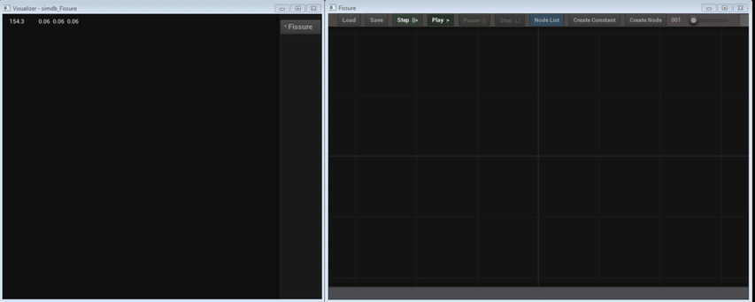
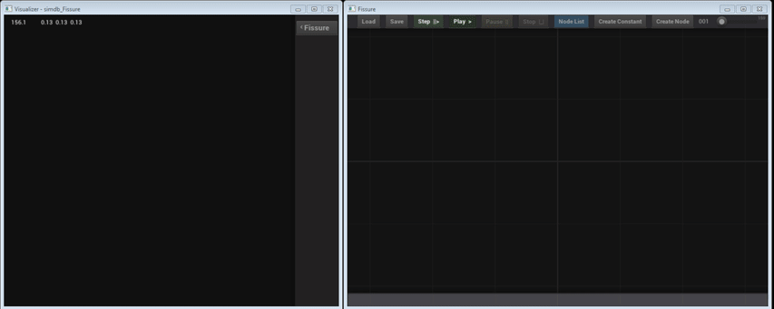

# LAVA - Live Asynchronous Visual Architecture

LAVA is a tool to create general purpose native software while allowing every piece to be lock free and asynchronous.

LAVA is designed to **_both_** significantly **_speed up development_** AND create **_signifcant amounts of lock free concurrency_**. 
It is written in C++11 and meant to potentially work with any language that can compile a shared library that exposes standard function calls.  The building blocks are single file libraries with no dependencies other than the C++11 standard library.

| __Tools__ |  |  |  |
| :---: | :---: | :---: | :---: |

| __Files__ | [Simdb.hpp](https://github.com/LiveAsynchronousVisualizedArchitecture/simdb) | [LavaFlow.hpp](Libraries.md#LavaFlow.hpp) | [tbl.hpp](Libraries.md#tbl.hpp) |
|  :---:    |          :---:         |         :---:                |       :---:        |

Short and Sweet Overview of How LAVA Runs

 
Threads are created which call LavaLoop().  Inside, they loop over generator nodes and available packets.
  
Generator nodes are any node that has no inputs and all message nodes.  When a thread doesn't find a packet, it picks a generator node to run instead.  The packets that nodes output are put into a queue so that all threads can find them. A packet is a struct which has a destination node and slot as well as a pointer to data that the node will use.
  
Since the packet data needs to be serialized, tbl.hpp is available to make node IO easier. Tbl is an array+hash map combination and can have sub-tables as values in the hash map.  It always uses a single span of memory and can be written to a file or shared memory then read directly, which makes it flexible and fast.   
 
 
Threads and the LavaLoop(). Generator nodes, message nodes, flow nodes, cycles. Packet queue. Tbl isn't neccesary but it's pretty great.   

### Classic Software Problems
|[*Scalability*](#scal)     |[*Iterations*](#iter)  |[*Modularity*](#mod)    |[*Concurrency*](#concr)       |[*Debugging*](#debug)   |
|       :---:               |      :---:            |   :---:                |    :---:                     |   :---:                |
|[OpenGL Graph](#graphui)   |[Live Reloading](#live)|[Shared Libs](#libs)    |[Execute in Parallel](#async) |[Shared Memory](#shrmem)|
|[Clear Interfaces](#clear) |[Output Baking](#bake) |[Crash Isolation](#crsh)|[Lock Free](#lkfree)          |[Visualization](#viz)   |
|[Flow+Msg Nodes](#flow-msg)|[Visualization](#viz)  |[Serial Data](#serial)  |[Persistant Threads](#thrds)  |[Tbl and Stats](#stats) |

 
 - <a id="scal"> __Scalable Complexity__ </a> - High level structure is not strictly enforced (or doesn't exist) and often subverted in some way to accomodate extra data/communication.
  
 - <a id="iter"> __Iterations__ </a> - As program size increases, iterations decrease due to re-compilation time, linking time, and the time to re-run the program when testing.
  
- <a id="mod"> __Modularity__ </a> - Modularity often breaks down due to data dependencies at run time and source dependencies at compile time, making re-use more difficult and increasing the barrier to entry for anyone to a project.

- <a id="concr"> __Concurrency__ </a> - Many techniques and libraries exist, often as heavy dependencies that have narrow use cases where they excel. Concurrency, parallelism and asynchronous design are perpetually difficult to get right and fragmented in their use.

- <a id="debug"> __Debugging__ </a> - Often means using slow builds, multiple runs to narrow down the problem and examining the state individual variables line by line.

### How LAVA Confronts These Problems

#### High Level Structure
- <a id="graphui"> __Graph UI__ </a> - A fluid, openGL accelerated UI for architecting software visually while implementing incrementally.

- <a id="clear"> __Clear Inputs and Outputs__ </a> - Every node has inputs and outputs that show up visually making their scope clear.  Programs can be created from relativly few nodes. simplifying the comprehension of how large projects fit together and how their pieces interact. 

- <a id="flow-msg"> __Data Flow and Message Passing__ </a> - Flow nodes can be used for stateless transformations, making any data separated into a packet be dealt with concurrently.  Message nodes can hold state, use flow nodes and dictate the overall behavior of a program. 
  
#### Iterations, Interactivity and Testing 

- <a id="live">__Live Reloading__</a> -  - Input data can be frozen and a single node can be recompiled, automatically hot reloaded, then automatically run using the now static input.  This enables fast iteration even in a large program by isolating a single piece and its input while continuously viewing its output.

- <a id="bake">__Constant Nodes__</a> - Constant nodes can offer a way to change input in real time for interactive testing with visualization of results.

- <a id="viz">__Visualization__</a> - Visualizations happen with lock free shared memory to external processes and does not interfere with the execution of the main program.

#### Modularity
- <a id="libs">__Shared Libraries__</a> - Contain one or more nodes and can change while the program is running. Compilation is isolated to the lib being revised as well as run time checks in debug builds.  

- <a id="crsh">__Interrupts and Exceptions__</a> - The LAVA loop catches low level interrupts so that a crash shows up in the graph as a red halo around the crashed node.

- <a id="serial">__Serialized Node IO__</a> - All communication between nodes is passed as pointer to a single span of contiguous memory. This means that all IO can be saved as a file, written to shared memory for visualization and debugging.  While this can work with any data structure that can be serialized, data structures that always use a single span of memory (like tbl.hpp) are likely to be a good default. 

#### Concurrency, Parallelism and Asynchronous Design

- <a id="async">__Separate Data Executes Concurrently__</a> - Every packet of data can be dealt with concurrently, giving a program lock free asynchronous execution with little effort. Parallelism is dictated by the amount that data can be isolated

- <a id="lkfree">__Lock Free by Default__</a> - Threads take packets from a queue and execute them using their destination node.  Memory for node IO is allocated lock free and owned by the thread using reference counting. Part of each thread's loop is deallocating memory after each node it executes. Even visualization is lock free using [simdb](https://github.com/LiveAsynchronousVisualizedArchitecture/simdb).

- <a id="thrds">__Threads Persist and Loop__</a> - Threads are meant to be created initially and loop, finding packets and executing them with their destination node. Each thread's stack can be used as thread local  eliminates overhead such as global memory allocation (which can lock) of thread creation.

#### Debugging

- <a id="shrmem">__Shared Memory__</a> - The use of  [simdb](https://github.com/LiveAsynchronousVisualizedArchitecture/simdb) allows extremlely fast IPC (interprocess communication) over shared memory.  Visualizing data (with the [Visualizer](#visualizer) tool) or examining data (with the [Brandisher](#brandisher) tool) while a program is running is easy and has minimal performance over head due to a lock free design and thread local output.  

- <a id="stats">__Tbl Tree View With Statistics__</a> - [Brandisher](#brandisher) displays any tbl in shared memory, even if it can't be visualized. Tbls and their sub-tbls are shown as trees. Arrays are shown using a graph along with statistics such as mean, median and mode. Keys are show with their types and values.

### Tools

 

|    Fissure                      |   Visualizer       |
|     :---:                       |     :---:          |
|  |  |
| Fissure is the node graph UI.  It can be used to construct a graph of nodes, run the program, visualize outputs, see node errors and view timing information about the nodes. | [Tables](README.md#tblhpp) that are in the IdxVerts format (3D geometry with optional normals, vertex colors, uvs, and a color texture map)  will be picked up by the visualizer and displayed with openGL. |

|<a id="brandisher">__Brandisher__</a>|          |
|          :---:                      |  :---    |
|| The brandisher is a tool for viewing tables and their sub-tables in shared memory. It can display a graph of the arrays' values as well as their basic statistics.   While some of the points making up the craftsman model are less than 0 on the Y axis, most are above 0.    We also see minimum, maximum, average (mean), most common (mode), and median (middle) values as well as the variance.   This is a useful way to get a high level view on arrays containing too many values to be looked at directly as text. |

### Examples

| <a id="load-obj">Load Obj</a> |
|   :---:  |
|  |
| A constant file path is passed to an obj file loader node.  The LoadObj node is not much more than a wrapper around the [Tiny Obj Loader](https://github.com/syoyo/tinyobjloader) by [Syoyo Fujita](https://github.com/syoyo) |

| <a id="camera-rays">Camera Rays</a> |
|   :---:  |
|  |
|  Ray tracing rays generated and visualized in real time as a memory mapped tbl file holding the parameters (the purple constant node) is changed. |

| <a id="brandisher-elements">Brandisher Elements</a> |
|    :---:                                          |
| |
|  Here the same tbl is shown in two different places.   On the right being edited as part of a const node (which just reads a .const file from disk).  On the left it is read from shared memory. |

| <a id="trace">Trace</a> |
|     :---:          |
|   |
| A trace node (a wrapper around [the Embree ray tracing library from Intel](https://github.com/embree/embree)) is added and generated rays are traced to find where they collide with geometry. |

| <a id="interactive-trace">Interactive Trace</a> | 
| :---: |
|  |
| The field of view for the generated rays is changed and visualized outputs are updated in real time. |

| <a id="constant-bake">Constant Bake</a> |
| :---: |
|  |
| An output that is already in shared memory (blue highlight, then stepped once) is middle-click dragged to make a constant node. This cuts the dependency on the rest of the graph while writing out the result to a file on disc. |

| <a id="shade-rays">Shade Rays</a> |
| :---: |
|  |
| The traced rays are combined with the GGX BRDF to get new ray directions that originate from the model. Their length when visualized is the result of their PDF (sample weight). |

| <a id="constant-shade">Constant Shade</a> |
|    :---: |
|  |
| The results of geometry loading, ray generation and ray tracing are written to a constant file for rapid iteration with no dependencies. |
  
### Caveats

 

 
- __Temporary Mutex__ - A mutex currently surrounds the main packet queue as a place holder. Eventually this should be a heirarchy of lock free queues that matches the memory heirarchy.  A very good concurrent queue can be found [here](https://github.com/cameron314/concurrentqueue) though this would introduce another file as a dependency.  [Simdb](https://github.com/LiveAsynchronousVisualizedArchitecture/simdb) (the IPC mechanism) and the output queue from each node is a thread local single-writer multi-reader lock free queue. 

- __Optional Arguments__ - Right now all inputs need to be connected for a node to run in a cycle. Optional arguments will allow nodes the flexibility to work with what they are given and not require a full set of inputs on every cycle. 

- __Message Node Structure__ - Message nodes need to be converted to have their own queues and their own threads, so that they are run one node at a time, with the same thread and with access to all the packets that have come to it.

- __Separate Visualization__ - Visualization should ideally be separated from the nodes themselves. Instead either fissure, the visualizer(or both) would convert from specific types to IdxVerts so that they can visualized.

- __Node Loops__ - Nodes' outputs looping back to their inputs should be possible now, though extra interface work will be needed to make what is happening clear, since the connection line will end up behind the node. 

- __Text Visualization__ - Building text, lists and spreadsheet views into Brandisher should not be difficult, but still needs to be done. 

- __Node Heirarchies__ - A single canvas of nodes could become unwieldy in a large program. Eventually collapsing groups of nodes into a single node will be neccesary so that a graph's complexity will scale well. 

### F.A.Q (Frequently Anticipated Questions)
  

### Internals
  
  
